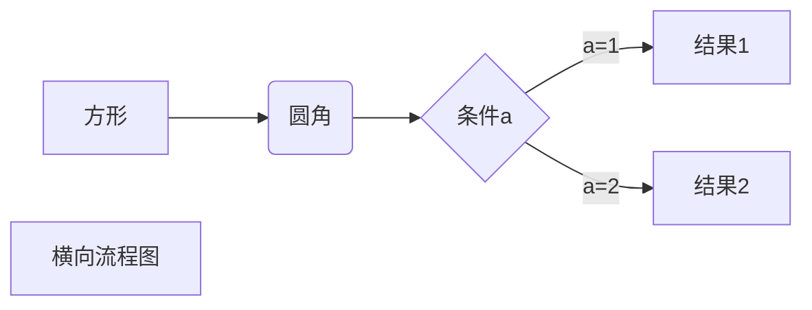
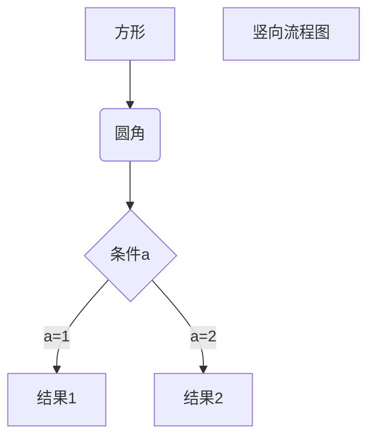
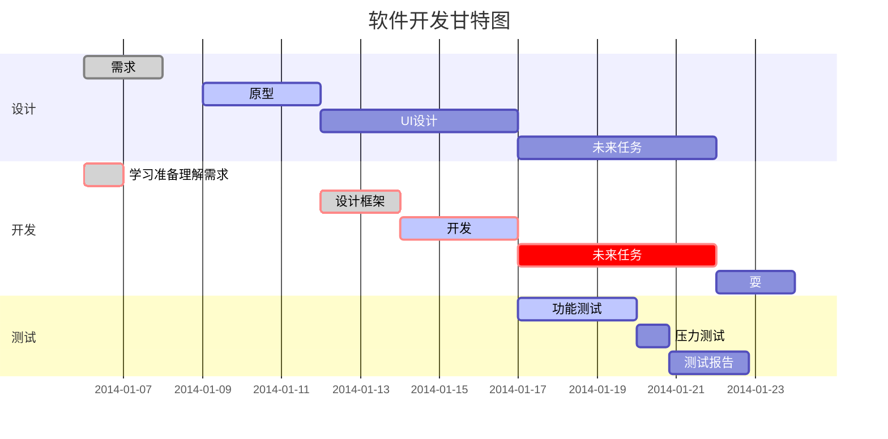

# 新华财经

293个区域划分

| 城市数量 | 省份                                           | 领主   |
| -------- | ---------------------------------------------- | ------ |
| 43个     | 内蒙，辽宁，吉林，黑龙江                       | 张豹   |
| 60       | 江苏，浙江，安徽，福建，江西                   | 石张毅 |
| 58       | 山东，河南，湖北，湖南                         | 柯玉强 |
| 57       | 广东，广西，海南，四川                         | 胡涛涛 |
| 53       | 贵州，云南，西藏，陕西，甘肃，青海，宁夏，新疆 | 王尚文 |





```sequence
对象A->对象B: 对象B你好吗?（请求）
Note right of 对象B: 对象B的描述
Note left of 对象A: 对象A的描述(提示)
对象B-->对象A: 我很好(响应)
对象A->对象B: 你真的好吗？
```

